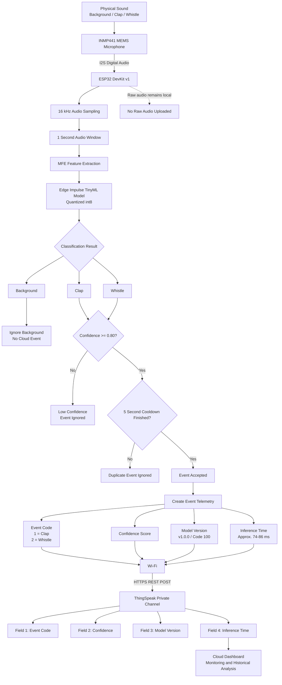

# Detailed System Block and Data-Flow Diagram
## P2 – Edge TinyML Acoustic Event Classifier

## Data-Flow Explanation

The INMP441 microphone captures physical sound and sends digital audio to the ESP32 DevKit v1 through the I2S interface.

The ESP32 samples the audio at 16 kHz and processes approximately one-second audio windows locally. MFE feature extraction converts the audio into features suitable for the Edge Impulse TinyML classifier.

The quantized int8 model classifies each audio window as background, clap, or whistle.

Background classifications are ignored and are not sent to the cloud.

For clap and whistle, the ESP32 checks whether the confidence is at least 0.80. Low-confidence classifications are ignored.

A five-second cooldown is used after an accepted event to reduce repeated event uploads.

For an accepted event, only small telemetry values are transmitted:
- Event code
- Confidence score
- Model version
- Inference time

The ESP32 sends this telemetry over Wi-Fi using an HTTPS REST request to a private ThingSpeak channel.

Raw audio remains on the ESP32 and is not uploaded to ThingSpeak. This reduces bandwidth use and improves privacy.

## Actual Prototype Results
- Model Testing Accuracy: 76.67%
- Background live confidence: up to 0.996
- Clap live confidence: up to 0.957
- Whistle live confidence: up to 0.996
- Event confidence threshold: 0.80
- Cooldown: 5 seconds
- Live processing time: approximately 74-86 ms
- Cloud platform: ThingSpeak
- Cloud protocol: HTTPS / REST
