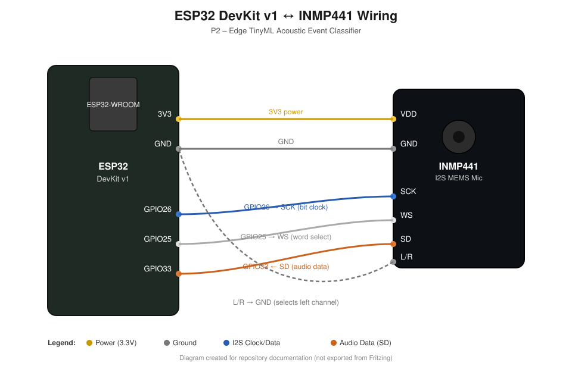

# ESP32 DevKit v1 and INMP441 Wiring

## P2 – Edge TinyML Acoustic Event Classifier

The prototype uses an ESP32 DevKit v1 connected to an INMP441 digital MEMS microphone through the I2S interface.

## Pin Connections

| ESP32 DevKit v1 | INMP441 | Purpose |
|---|---|---|
| 3V3 | VDD | 3.3 V power |
| GND | GND | Ground |
| GPIO26 | SCK | I2S bit clock |
| GPIO25 | WS | I2S word select |
| GPIO33 | SD | Microphone audio data |
| GND | L/R | Select left audio channel |

## Configuration

- Microcontroller: ESP32 DevKit v1
- Microphone: INMP441 I2S MEMS microphone
- Sample rate: 16 kHz
- Audio classes: background, clap and whistle
- Signal processing: MFE
- Machine learning: Edge Impulse TinyML
- Deployment model: Quantized int8

## Group Members

- Tanveer Singh
- Harpreet

The INMP441 captures digital audio and sends it to the ESP32 through I2S. The ESP32 processes the audio locally and runs the TinyML classification model. Raw audio is not continuously uploaded to the cloud.
